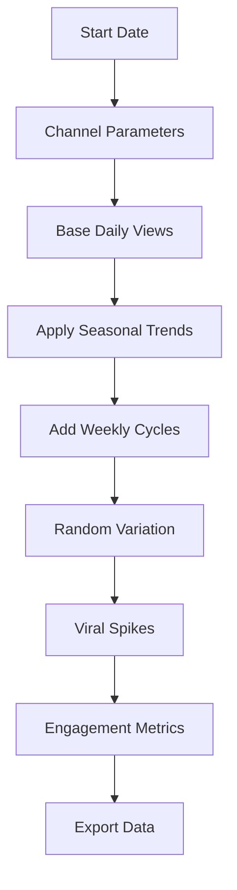

# YouTube Views Forecasting Dataset Generator

[](https://choosealicense.com/licenses/mit/)
[](https://developer.mozilla.org/en-US/docs/Web/JavaScript)
[](https://developer.mozilla.org/en-US/docs/Web/HTML)
[](https://www.microsoft.com/en-us/microsoft-365/excel)

> A powerful web-based tool that generates realistic YouTube analytics data for building and testing forecasting models. Perfect for data scientists, analysts, and students who need authentic-looking YouTube metrics without using real channel data.

## Table of Contents

- [Features](#features)
- [Demo](#demo)
- [Quick Start](#quick-start)
- [Data Schema](#data-schema)
- [Use Cases](#use-cases)
- [Excel Integration](#excel-integration)
- [Technical Details](#technical-details)
- [Contributing](#contributing)
- [License](#license)

## Features

### 🎯 Realistic Data Generation
- **Multiple channel types**: Gaming, Tech Reviews, Lifestyle, Education, Entertainment
- **Channel size tiers**: Small (1K-10K), Medium (10K-100K), Large (100K-1M), Mega (1M+)
- **Seasonal patterns**: Holiday effects, summer/winter trends, monthly variations
- **Weekly cycles**: Weekend boosts, Monday dips, day-of-week patterns
- **Viral content simulation**: Random trending spikes based on content type
- **Upload frequency impact**: Models how posting schedule affects views

### 📊 Comprehensive Metrics
- View analytics (daily, cumulative, patterns)
- Engagement data (likes, comments, shares, subscriber growth)
- Performance metrics (CTR, retention rate, average view duration)
- Content tracking (videos uploaded, cumulative count)
- Time features (date, day of week, month, quarter, weekend flags)

### 💾 Export Options
- **Excel Format** (.xlsx) with auto-sized columns
- **CSV Format** (.csv) for universal compatibility
- **Automatic fallback** to CSV if Excel export fails

## Demo


*Example of the web interface showing data generation controls and preview*

## Quick Start

### Option 1: Use Online (Recommended)

1. **Download or clone** this repository
   ```bash
   git clone https://github.com/yourusername/youtube-forecasting-dataset.git
   cd youtube-forecasting-dataset
   ```

2. **Open the tool** in your web browser
   ```bash
   # Open directly
   open index.html
   
   # Or serve locally
   python -m http.server 8000
   # Then visit http://localhost:8000
   ```

3. **Configure parameters**
   - Set date range (start and end dates)
   - Choose channel type
   - Select channel size

4. **Generate and download**
   - Click "🚀 Generate Dataset"
   - Use "📊 Download Excel" or "📄 Download CSV"

### Option 2: Integrate into Your Project

```html
<!-- Include the generator in your HTML -->
<script src="https://cdnjs.cloudflare.com/ajax/libs/xlsx/0.18.5/xlsx.full.min.js"></script>
<script src="youtube-data-generator.js"></script>
```

## Data Schema

| Column Name | Data Type | Description | Sample Value |
|-------------|-----------|-------------|--------------|
| **Date** | Date | Calendar date | `2024-01-15` |
| **DayOfWeek** | String | Day name | `Monday` |
| **Views** | Integer | Daily view count | `15432` |
| **CumulativeViews** | Integer | Total views to date | `1250000` |
| **VideosUploaded** | Integer | Videos posted that day | `1` |
| **CumulativeVideos** | Integer | Total videos published | `156` |
| **AvgViewDuration** | Integer | Average watch time (seconds) | `245` |
| **Likes** | Integer | Daily likes received | `312` |
| **Comments** | Integer | Daily comments | `78` |
| **Shares** | Integer | Daily shares | `23` |
| **NewSubscribers** | Integer | Daily subscriber growth | `45` |
| **CTR** | Float | Click-through rate (%) | `4.25` |
| **Retention** | Float | Average retention rate (%) | `68.5` |
| **IsWeekend** | Binary | Weekend flag (1/0) | `1` |
| **Month** | Integer | Month number (1-12) | `3` |
| **Quarter** | Integer | Quarter number (1-4) | `1` |
| **Year** | Integer | Calendar year | `2024` |

## Use Cases

<table>
<tr>
<td width="33%">

### 🔬 Data Scientists
- Train time series forecasting models
- Test different forecasting approaches
- Experiment with feature engineering
- Create benchmarking datasets

</td>
<td width="33%">

### 🎓 Students & Educators
- Practice forecasting without privacy concerns
- Demonstrate time series concepts
- Build data science portfolios
- Academic research projects

</td>
<td width="33%">

### 📈 Business Analysts
- Test forecasting frameworks
- Model different content strategies
- Perform scenario analysis
- Practice KPI forecasting

</td>
</tr>
</table>

## Excel Integration

The generated data works seamlessly with Excel for building forecasting models.

### Recommended Excel Workbook Structure

```
📊 YouTube_Forecasting_Model.xlsx
├── 📄 Data (imported dataset)
├── 📄 Analysis (pivot tables & charts)
├── 📄 Forecasting (prediction models)
└── 📄 Dashboard (visualizations)
```

### Key Excel Formulas

**7-day Moving Average**
```excel
=AVERAGE(OFFSET(B2,-6,0,7,1))
```

**Exponential Smoothing (α=0.3)**
```excel
=0.3*B2 + 0.7*C1
```

**Seasonal Adjustment**
```excel
=Views * AVERAGE(IF(Month=MONTH(TODAY()),Views))/AVERAGE(Views)
```

**Weekend Impact Factor**
```excel
=IF(IsWeekend=1, Views/AVERAGEIF(IsWeekend,1,Views), Views/AVERAGEIF(IsWeekend,0,Views))
```

### Forecasting Model Examples

| Model Type | Complexity | Excel Implementation |
|------------|------------|---------------------|
| **Moving Average** | Beginner | `AVERAGE()` function |
| **Linear Trend** | Beginner | `FORECAST.LINEAR()` |
| **Exponential Smoothing** | Intermediate | Custom formulas |
| **Multiple Regression** | Intermediate | Data Analysis ToolPak |
| **Seasonal Decomposition** | Advanced | Combination of functions |

## Technical Details

### Data Generation Algorithm



### Channel Characteristics

| Channel Type | Weekend Boost | Viral Probability | Audience Pattern |
|--------------|---------------|-------------------|------------------|
| **Gaming** | 1.4x | 15% | Heavy weekend viewing |
| **Tech Reviews** | 0.8x | 10% | Weekday professional viewing |
| **Lifestyle** | 1.2x | 20% | Mixed schedule, high engagement |
| **Education** | 0.7x | 5% | Consistent weekday pattern |
| **Entertainment** | 1.5x | 25% | High weekend activity |

### Channel Size Impact

| Size Category | Base Daily Views | Variance Level | Typical Range |
|---------------|------------------|----------------|---------------|
| **Small** (1K-10K) | 100 | High (80%) | 20-500 views |
| **Medium** (10K-100K) | 1,000 | Medium (60%) | 400-2,500 views |
| **Large** (100K-1M) | 10,000 | Lower (40%) | 6,000-15,000 views |
| **Mega** (1M+) | 50,000 | Low (30%) | 35,000-80,000 views |

## Contributing

We welcome contributions! Here's how you can help:

### 🐛 Report Issues
Found a bug? [Open an issue](../../issues/new) with:
- Clear description of the problem
- Steps to reproduce
- Expected vs actual behavior
- Browser/environment details

### 💡 Suggest Features
Have an idea? [Start a discussion](../../discussions/new) or [open a feature request](../../issues/new).

### 🛠️ Submit Code
1. **Fork** the repository
2. **Create** a feature branch (`git checkout -b feature/amazing-feature`)
3. **Commit** your changes (`git commit -m 'Add amazing feature'`)
4. **Push** to the branch (`git push origin feature/amazing-feature`)
5. **Open** a Pull Request

### Ideas for Contributions
- [ ] Add more channel types (Music, Sports, News, Cooking)
- [ ] Implement additional export formats (JSON, Parquet)
- [ ] Add data quality validation
- [ ] Create visualization dashboards
- [ ] Improve mobile responsiveness
- [ ] Add geographic data simulation
- [ ] Implement real-time streaming simulation

## Roadmap

- [ ] **Multi-channel datasets** - Compare multiple channels
- [ ] **Geographic breakdowns** - Views by country/region  
- [ ] **Device analytics** - Mobile vs desktop splits
- [ ] **Revenue simulation** - Ad earnings and sponsorships
- [ ] **API endpoints** - Programmatic data access
- [ ] **Jupyter notebooks** - Analysis examples
- [ ] **Real-time streaming** - Live data simulation

## License

This project is licensed under the MIT License - see the [LICENSE](LICENSE) file for details.

## Acknowledgments

- [SheetJS](https://sheetjs.com/) - For Excel file generation
- YouTube Analytics - Inspiration for realistic data patterns
- Time Series Forecasting Community - For model insights

## Support

- 🐛 **Bug Reports**: [GitHub Issues](../../issues)
- 💬 **Questions**: [GitHub Discussions](../../discussions)  
- 📖 **Documentation**: [Project Wiki](../../wiki)
- ⭐ **Star this repo** if you find it useful!

---

<div align="center">

**Built with ❤️ for the data science and YouTube creator communities**

[⬆ Back to Top](#youtube-views-forecasting-dataset-generator)

</div>
